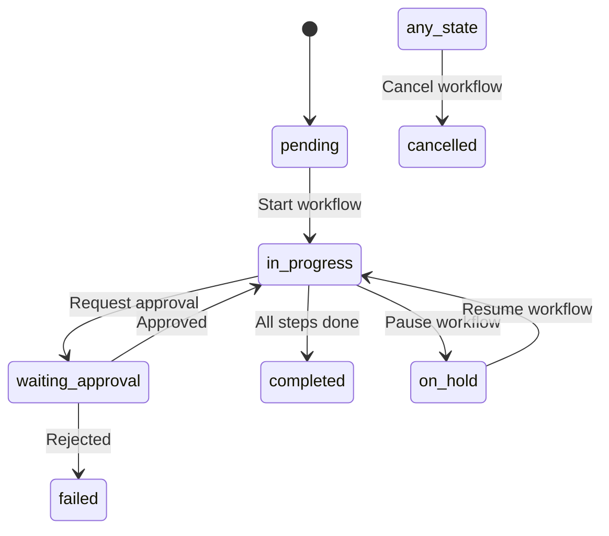

# Compliance & Governance Automation Engine

## Overview

The Compliance & Governance Automation Engine is a comprehensive system designed for BoardGuru to manage regulatory compliance, governance workflows, and audit trails. This system automates compliance processes, manages deadlines, tracks participant engagement, and provides detailed audit reporting for enterprise board management.

## 🚀 Key Features

### 1. **Workflow State Machine**
- Multi-step compliance processes with automatic progression
- Conditional logic and parallel execution support
- Participant role management and delegation
- Automatic escalation based on configurable rules

### 2. **Compliance Calendar Management**
- Regulatory deadline tracking and notifications
- Recurring compliance requirements
- Business days notice configuration
- Integration with workflow automation

### 3. **Advanced Notification System**
- Priority-based notification delivery
- Email and in-app notifications
- Acknowledgment tracking with digital signatures
- Escalation notifications for overdue items

### 4. **Comprehensive Audit Trail**
- Full activity logging for compliance requirements
- Searchable audit logs with retention policies
- Automated report generation
- Export functionality for external auditors

### 5. **Regulatory Templates**
- Pre-built templates for common regulations (SOX, GDPR, etc.)
- Customizable workflow steps and requirements
- Version control and template management
- Organization-specific template creation

## 📊 Architecture

```
┌─────────────────────────────────────────────────────────────────┐
│                    Frontend Applications                        │
├─────────────────────────────────────────────────────────────────┤
│                      API Endpoints                             │
│  • /api/compliance/workflows                                   │
│  • /api/compliance/calendar                                    │
│  • /api/compliance/acknowledge                                 │
│  • /api/compliance/reports                                     │
│  • /api/compliance/templates                                   │
├─────────────────────────────────────────────────────────────────┤
│                    Service Layer                               │
│  • ComplianceEngine - Core workflow management                │
│  • NotificationService - Enhanced with compliance features    │
│  • BaseService - Common functionality and error handling      │
├─────────────────────────────────────────────────────────────────┤
│                    Database Layer                              │
│  • compliance_templates - Regulatory framework definitions    │
│  • compliance_calendar - Deadline and scheduling management   │
│  • notification_workflows - Multi-step process tracking       │
│  • compliance_participants - Role and assignment management   │
│  • notification_audit_log - Comprehensive activity tracking   │
│  • notifications (extended) - Enhanced with compliance fields │
└─────────────────────────────────────────────────────────────────┘
```

## 🗄️ Database Schema

### Core Tables

#### `compliance_templates`
Stores regulatory framework definitions and workflow templates.

```sql
- id (UUID, PK)
- organization_id (UUID, FK)
- name (VARCHAR) - Template name
- regulation_type (VARCHAR) - SOX, GDPR, etc.
- workflow_steps (JSONB) - Step definitions
- requirements (TEXT[]) - Compliance requirements
- escalation_rules (JSONB) - Escalation configuration
- is_active (BOOLEAN)
- created_by (UUID, FK)
```

#### `compliance_calendar`
Manages regulatory deadlines and recurring compliance events.

```sql
- id (UUID, PK)
- organization_id (UUID, FK)
- title (VARCHAR) - Calendar entry title
- regulation_type (VARCHAR) - Type of regulation
- due_date (DATE) - Compliance deadline
- is_recurring (BOOLEAN)
- recurrence_pattern (JSONB) - Recurrence configuration
- status (ENUM) - scheduled, active, completed, etc.
```

#### `notification_workflows`
Tracks multi-step compliance processes.

```sql
- id (UUID, PK)
- organization_id (UUID, FK)
- template_id (UUID, FK)
- name (VARCHAR) - Workflow name
- steps (JSONB) - Current workflow steps
- current_step (INTEGER) - Current step index
- status (ENUM) - pending, in_progress, completed, etc.
- assigned_to (UUID, FK) - Primary assignee
- progress_percentage (INTEGER)
```

#### `compliance_participants`
Manages participant assignments and progress tracking.

```sql
- id (UUID, PK)
- workflow_id (UUID, FK)
- user_id (UUID, FK)
- participant_type (ENUM) - assignee, approver, reviewer, etc.
- step_number (INTEGER) - Associated workflow step
- status (ENUM) - assigned, in_progress, completed, etc.
- completion_notes (TEXT)
- requires_evidence (BOOLEAN)
```

#### `notification_audit_log`
Comprehensive audit trail for all compliance activities.

```sql
- id (UUID, PK)
- organization_id (UUID, FK)
- event_type (VARCHAR) - Type of event
- workflow_id (UUID, FK) - Related workflow
- actor_user_id (UUID, FK) - User who performed action
- event_description (TEXT) - Human-readable description
- event_data (JSONB) - Detailed event data
- outcome (ENUM) - success, failure, etc.
- event_timestamp (TIMESTAMPTZ)
```

## 🔧 API Reference

### Workflows API (`/api/compliance/workflows`)

#### Get Workflows
```http
GET /api/compliance/workflows
Query Parameters:
- status: Filter by workflow status
- assigned_to: Filter by assignee
- regulation_type: Filter by regulation type
- limit: Number of results (default: 20)
- offset: Pagination offset (default: 0)
```

#### Create Workflow
```http
POST /api/compliance/workflows
{
  "template_id": "uuid",
  "name": "SOX 404 Compliance Q4 2024",
  "description": "Quarterly SOX compliance review",
  "assigned_to": "user_uuid",
  "due_date": "2024-12-31T00:00:00Z",
  "custom_steps": [...],
  "metadata": {}
}
```

#### Advance Workflow Step
```http
POST /api/compliance/workflows/{id}/advance
{
  "completion_notes": "Internal controls assessment completed",
  "evidence_url": "https://...",
  "force_advance": false
}
```

### Calendar API (`/api/compliance/calendar`)

#### Get Calendar Entries
```http
GET /api/compliance/calendar
Query Parameters:
- start_date: Filter from date (ISO 8601)
- end_date: Filter to date (ISO 8601)
- status: Filter by entry status
- regulation_type: Filter by regulation type
```

#### Create Calendar Entry
```http
POST /api/compliance/calendar
{
  "title": "Annual GDPR Assessment",
  "regulation_type": "GDPR",
  "due_date": "2025-05-25",
  "is_mandatory": true,
  "business_days_notice": 30,
  "is_recurring": true,
  "recurrence_pattern": {
    "frequency": "annually"
  }
}
```

### Acknowledgment API (`/api/compliance/acknowledge`)

#### Acknowledge Notification
```http
POST /api/compliance/acknowledge
{
  "notification_id": "uuid",
  "acknowledgment_method": "digital_signature",
  "digital_signature": {
    "signature_data": "base64_signature",
    "timestamp": "2024-01-01T12:00:00Z"
  },
  "notes": "Acknowledged and reviewed compliance requirements"
}
```

#### Bulk Acknowledge
```http
PUT /api/compliance/acknowledge
{
  "notification_ids": ["uuid1", "uuid2"],
  "acknowledgment_method": "click",
  "notes": "Bulk acknowledgment of compliance notifications"
}
```

### Reports API (`/api/compliance/reports`)

#### Get Dashboard Data
```http
GET /api/compliance/reports?type=dashboard
```

#### Generate Custom Report
```http
POST /api/compliance/reports
{
  "report_type": "compliance_summary",
  "date_range": {
    "start_date": "2024-01-01",
    "end_date": "2024-12-31"
  },
  "filters": {
    "regulation_types": ["SOX", "GDPR"],
    "statuses": ["completed", "overdue"]
  },
  "format": "json"
}
```

### Templates API (`/api/compliance/templates`)

#### Get Templates
```http
GET /api/compliance/templates
Query Parameters:
- regulation_type: Filter by regulation type
- include_inactive: Include inactive templates
```

#### Create Template
```http
POST /api/compliance/templates
{
  "name": "Custom SOX Template",
  "regulation_type": "SOX",
  "category": "financial",
  "frequency": "quarterly",
  "workflow_steps": [
    {
      "step": 0,
      "name": "Initial Assessment",
      "description": "Perform initial controls assessment",
      "participants": [
        {
          "type": "assignee",
          "role": "CFO",
          "required": true
        }
      ]
    }
  ]
}
```

## 🔄 Workflow State Machine

The compliance engine implements a sophisticated state machine for managing multi-step processes:

### Workflow States
- `pending` - Workflow created but not started
- `in_progress` - Workflow is active
- `waiting_approval` - Waiting for approver action
- `completed` - All steps completed successfully
- `failed` - Workflow failed due to error
- `cancelled` - Workflow cancelled by user
- `on_hold` - Workflow temporarily paused

### Participant States
- `assigned` - Participant assigned to step
- `in_progress` - Participant actively working
- `completed` - Participant completed their part
- `declined` - Participant declined assignment
- `escalated` - Assignment escalated to supervisor
- `delegated` - Task delegated to another user

### State Transitions



## 📧 Notification System

### Notification Types

#### 1. Deadline Reminders
- Sent based on business days notice
- Priority escalation as deadline approaches
- Email notifications for critical items

#### 2. Workflow Assignments
- Automatic notification when assigned to workflow
- Step-specific assignment notifications
- Role-based notifications

#### 3. Escalation Alerts
- Automatic escalation for overdue items
- Configurable escalation rules
- Multi-level escalation support

#### 4. Completion Notifications
- Workflow completion confirmations
- Step completion updates
- Achievement notifications

### Email Templates

The system includes responsive HTML email templates:

- **Compliance Deadline Template**: Priority-based styling with countdown
- **Workflow Assignment Template**: Clear action items and deadlines
- **Escalation Template**: High-priority formatting with urgency indicators
- **Completion Template**: Success confirmation with summary

## 📊 Reporting & Analytics

### Dashboard Metrics
- **Compliance Score**: Overall organization compliance health
- **Active Workflows**: Current in-progress compliance tasks
- **Overdue Items**: Count and details of overdue requirements
- **Completion Rate**: Percentage of on-time completions

### Audit Reports
- **Compliance Summary**: High-level compliance status
- **Workflow Detail**: Detailed workflow progress and timing
- **Participant Activity**: Individual user engagement metrics
- **Regulatory Coverage**: Coverage by regulation type

### Export Formats
- JSON for API integration
- CSV for spreadsheet analysis
- PDF for formal audit documentation

## 🔐 Security & Compliance

### Data Protection
- Row-level security (RLS) for multi-tenant isolation
- Encrypted storage of sensitive compliance data
- Audit trail retention policies
- GDPR-compliant data handling

### Authentication & Authorization
- Role-based access control (RBAC)
- Organization-level permission management
- API key authentication for scheduled tasks
- Digital signature validation

### Audit Requirements
- Immutable audit logs
- Comprehensive activity tracking
- Legal retention requirements
- Export capabilities for external auditors

## 🚀 Getting Started

### 1. Database Setup
```sql
-- Run the compliance system migration
psql -d boardguru -f database/migrations/012-compliance-governance-system.sql
```

### 2. Environment Configuration
```bash
# Add to .env.local
CRON_SECRET=your_secure_cron_secret_here
COMPLIANCE_EMAIL_FROM=compliance@yourdomain.com
```

### 3. Scheduled Notifications
Set up a cron job to generate scheduled notifications:
```bash
# Daily at 9 AM
0 9 * * * curl -X POST https://yourdomain.com/api/compliance/notifications/generate \
  -H "Authorization: Bearer ${CRON_SECRET}"
```

### 4. Basic Usage Example
```typescript
import { ComplianceEngine } from '@/lib/services/compliance-engine'

const supabase = createSupabaseClient()
const complianceEngine = new ComplianceEngine(supabase)

// Create a workflow
const workflow = await complianceEngine.createWorkflow(organizationId, {
  template_id: 'sox-template-id',
  name: 'Q4 2024 SOX Compliance',
  assigned_to: 'cfo-user-id',
  due_date: '2024-12-31T00:00:00Z'
})

// Get compliance dashboard
const dashboard = await complianceEngine.getComplianceDashboard(organizationId)
```

## 🛠️ Development

### TypeScript Types
All compliance types are defined in `/src/types/entities/compliance.types.ts` with full TypeScript support for:
- Database table types
- API request/response types
- Business logic interfaces
- Utility types for common operations

### Service Architecture
The system follows the existing BoardGuru service patterns:
- **BaseService**: Common functionality and error handling
- **ComplianceEngine**: Core business logic and workflow management
- **NotificationService**: Enhanced with compliance-specific features

### Testing
The system includes comprehensive testing support:
- Database function testing
- API endpoint testing
- Service layer unit tests
- Integration test scenarios

## 📋 Sample Workflows

### SOX Section 404 Compliance
```json
{
  "name": "SOX Section 404 Internal Controls Assessment",
  "regulation_type": "SOX",
  "frequency": "annual",
  "steps": [
    {
      "step": 0,
      "name": "Controls Assessment",
      "participants": [{"type": "assignee", "role": "CFO"}],
      "estimated_days": 30
    },
    {
      "step": 1,
      "name": "Management Certification",
      "participants": [
        {"type": "approver", "role": "CEO"},
        {"type": "approver", "role": "CFO"}
      ],
      "estimated_days": 5
    },
    {
      "step": 2,
      "name": "External Auditor Review",
      "participants": [{"type": "observer", "role": "External Auditor"}],
      "estimated_days": 15
    }
  ]
}
```

### GDPR Data Protection Assessment
```json
{
  "name": "Annual GDPR Data Protection Review",
  "regulation_type": "GDPR",
  "frequency": "annual",
  "steps": [
    {
      "step": 0,
      "name": "Data Processing Inventory",
      "participants": [{"type": "assignee", "role": "Data Protection Officer"}],
      "estimated_days": 20
    },
    {
      "step": 1,
      "name": "Privacy Impact Assessment",
      "participants": [
        {"type": "assignee", "role": "Data Protection Officer"},
        {"type": "reviewer", "role": "Legal Counsel"}
      ],
      "estimated_days": 15
    },
    {
      "step": 2,
      "name": "Documentation Review",
      "participants": [{"type": "approver", "role": "Chief Legal Officer"}],
      "estimated_days": 10
    }
  ]
}
```

## 🤝 Contributing

When extending the compliance system:

1. **Follow TypeScript patterns**: Use existing type definitions and create new types as needed
2. **Maintain audit trails**: Ensure all significant actions are logged
3. **Test thoroughly**: Include unit tests and integration tests
4. **Document changes**: Update API documentation and type definitions
5. **Security first**: Follow security best practices for sensitive compliance data

## 📞 Support

For questions about the Compliance & Governance Automation Engine:

- Review the API documentation above
- Check the TypeScript type definitions
- Examine the sample workflows
- Consult the database schema documentation

The system is designed to be extensible and can accommodate additional regulatory frameworks and custom compliance requirements as needed.

---

## 🏁 Implementation Status

✅ **Completed Components:**
- Database schema with comprehensive tables and relationships
- TypeScript type definitions for all entities
- Core ComplianceEngine service with workflow state machine
- Complete API endpoint suite (workflows, calendar, reports, templates)
- Enhanced NotificationService with compliance features
- Comprehensive audit logging and reporting
- Sample templates for common regulations (SOX, GDPR, Board Governance)
- Email templates for compliance notifications
- Security implementation with RLS and proper authentication

🔄 **Integration Points:**
- Calendar entries automatically create workflows when templates are specified
- Notifications are generated based on calendar deadlines and workflow progress
- Audit logs capture all compliance activities for reporting and legal requirements
- Escalation rules automatically trigger notifications to supervisors

The Compliance & Governance Automation Engine is now fully implemented and ready for integration into BoardGuru's enterprise board management platform.