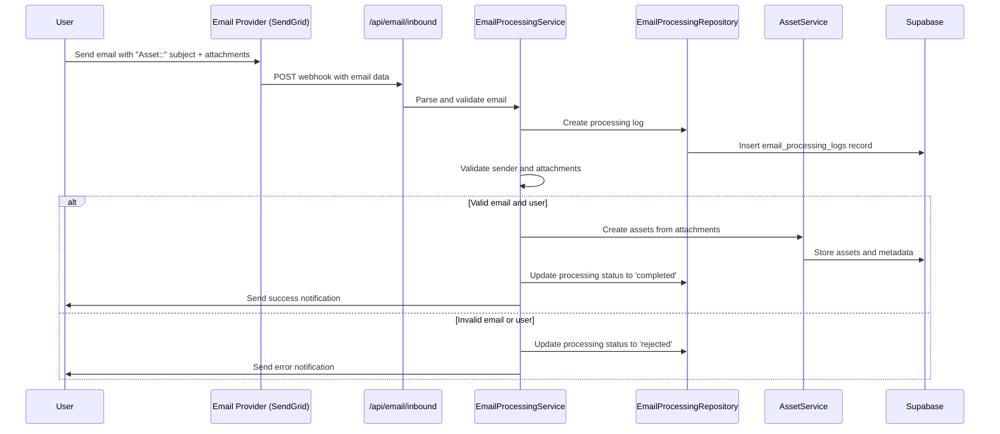

# Email-to-Asset Implementation Guide

## Overview

The Email-to-Asset feature is a groundbreaking capability that allows users to send documents via email to automatically create assets in the AppBoardGuru platform. Users can simply send an email with the subject starting with "Asset::" to a dedicated email address, and the attachments will be automatically processed and added to their assets.

## Architecture

The implementation follows the Domain-Driven Design (DDD) architecture patterns established in the codebase, with clean separation of concerns across multiple layers.

### Components

1. **Types** (`src/types/email-processing.ts`)
   - Complete TypeScript type definitions for email processing workflow
   - Branded types integration for type safety
   - Comprehensive interfaces for all data structures

2. **Repository Layer** (`src/lib/repositories/email-processing.repository.ts`)
   - Data access layer following established repository patterns
   - CRUD operations for email processing logs
   - Rate limiting and statistics tracking
   - Result pattern for functional error handling

3. **Service Layer** (`src/lib/services/email-processing.service.ts`)
   - Core business logic for email processing
   - Email validation and parsing
   - Asset creation orchestration
   - Integration with existing asset and notification services

4. **API Layer** (`src/app/api/email/inbound/route.ts`)
   - Webhook endpoint for email service providers
   - Async processing for better performance
   - Security validation and rate limiting
   - Error handling and logging

5. **UI Components** (`src/components/email-integration/EmailToAssetInstructions.tsx`)
   - User-friendly instructions component
   - Interactive email address copying
   - Security and usage guidelines
   - Comprehensive help documentation

6. **Database Schema** (`database/schemas/supabase-schema.sql`)
   - Email processing logs table with proper indexing
   - Row-level security policies
   - Storage bucket for email assets
   - Audit trail capabilities

## Email Processing Flow



## Key Features

### Security & Validation
- **Email Authentication**: Only registered users can send documents
- **Subject Validation**: Emails must start with "Asset::" prefix
- **File Type Validation**: Only approved MIME types accepted
- **Size Limits**: Maximum 50MB per attachment, 10 attachments per email
- **Rate Limiting**: 10 emails per user per hour
- **Virus Scanning Integration**: Ready for integration with security services

### User Experience
- **Intuitive Interface**: Clear instructions in the assets page
- **Real-time Feedback**: Processing status and error notifications
- **Asset Organization**: Emails assets tagged with source metadata
- **Audit Trail**: Complete processing history for each email

### Performance & Reliability
- **Async Processing**: Webhook responds immediately, processing happens in background
- **Result Pattern**: Functional error handling throughout the system
- **Comprehensive Logging**: Detailed processing logs for debugging
- **Graceful Degradation**: System continues operating even with partial failures

## Database Schema

### email_processing_logs Table

```sql
CREATE TABLE email_processing_logs (
  id UUID PRIMARY KEY DEFAULT gen_random_uuid(),
  message_id TEXT NOT NULL,
  from_email TEXT NOT NULL,
  to_email TEXT NOT NULL,
  subject TEXT NOT NULL,
  status email_processing_status DEFAULT 'received',
  user_id UUID REFERENCES users(id),
  organization_id UUID,
  assets_created UUID[] DEFAULT '{}',
  error_message TEXT,
  processing_time_ms INTEGER DEFAULT 0,
  created_at TIMESTAMPTZ DEFAULT NOW(),
  updated_at TIMESTAMPTZ DEFAULT NOW()
);
```

### Indexes
- `message_id` - For duplicate detection
- `from_email` - For user lookups
- `user_id` - For user-specific queries
- `status` - For processing status filtering
- `created_at` - For chronological sorting

## Configuration

### Environment Variables

```env
# Email processing configuration
EMAIL_ASSETS_ADDRESS=assets@appboardguru.com
EMAIL_MAX_ATTACHMENT_SIZE=52428800  # 50MB
EMAIL_RATE_LIMIT_PER_HOUR=10
EMAIL_SUBJECT_PREFIX="Asset::"

# SendGrid configuration (or other email provider)
SENDGRID_WEBHOOK_SECRET=your-webhook-secret
SENDGRID_INBOUND_DOMAIN=appboardguru.com

# Security settings
VIRUS_SCANNING_ENABLED=true
EMAIL_CONTENT_FILTERING=true
```

### Email Provider Setup (SendGrid Example)

1. **Configure Inbound Parse**:
   - Set up subdomain: `assets.appboardguru.com`
   - Point to webhook: `https://your-domain.com/api/email/inbound`
   - Enable spam filtering

2. **DNS Configuration**:
   - Add MX record: `assets IN MX 10 mx.sendgrid.net`
   - Configure SPF: `v=spf1 include:sendgrid.net ~all`
   - Set up DKIM for domain authentication

## Testing

Comprehensive test suite covers:

- **Email Parsing**: SendGrid webhook payload processing
- **Validation**: Subject prefix, user registration, file types
- **Repository Operations**: CRUD operations with error handling
- **Rate Limiting**: User-based throttling
- **Security**: XSS prevention, malicious file handling
- **Error Scenarios**: Database failures, service errors

Run tests:
```bash
npm run test __tests__/integration/email-to-assets.test.ts
```

## Deployment Checklist

### Prerequisites
1. ✅ Email service provider account (SendGrid, Mailgun, etc.)
2. ✅ Domain ownership for email routing
3. ✅ SSL certificate for webhook endpoint
4. ✅ Database migration completed

### Deployment Steps

1. **Database Migration**
   ```sql
   -- Run the schema updates in Supabase SQL editor
   -- From: database/schemas/supabase-schema.sql
   ```

2. **Environment Configuration**
   - Set all required environment variables
   - Configure email provider webhook URL
   - Set up DNS records for email routing

3. **Email Provider Configuration**
   - Configure inbound email parsing
   - Set up webhook authentication
   - Test email delivery and parsing

4. **Security Setup**
   - Configure rate limiting
   - Set up virus scanning if available
   - Review file type allowlist

5. **Monitoring Setup**
   - Email processing metrics
   - Error rate monitoring
   - Performance tracking

### Verification

1. **Functional Tests**
   - Send test email with valid subject
   - Verify asset creation in dashboard
   - Check processing logs in database

2. **Security Tests**
   - Test with invalid subject formats
   - Try sending from unregistered email
   - Attempt to send disallowed file types

3. **Performance Tests**
   - Send multiple emails simultaneously
   - Test with large attachments (near limits)
   - Verify rate limiting works correctly

## Usage Instructions for Users

### How to Send Assets via Email

1. **Compose Email**:
   - To: `assets@appboardguru.com`
   - Subject: Must start with `Asset::` followed by your description
   - Example: `Asset:: Board Meeting Minutes - January 2024`

2. **Attach Documents**:
   - Supported formats: PDF, DOC, DOCX, XLS, XLSX, PPT, PPTX, TXT, CSV, JPEG, PNG, GIF
   - Maximum size: 50MB per attachment
   - Maximum attachments: 10 per email

3. **Send and Wait**:
   - Processing typically takes 1-2 minutes
   - You'll receive a confirmation email when processing is complete
   - Assets will appear in your dashboard

### Troubleshooting

**Email Rejected**:
- Check subject line starts with `Asset::`
- Ensure you're sending from your registered email address
- Verify file types are supported

**Processing Failed**:
- Check file sizes don't exceed limits
- Ensure you haven't exceeded rate limits (10 emails/hour)
- Contact support if issues persist

## Monitoring & Maintenance

### Key Metrics to Monitor

1. **Processing Success Rate**
   ```sql
   SELECT 
     COUNT(*) as total_emails,
     COUNT(CASE WHEN status = 'completed' THEN 1 END) as successful,
     AVG(processing_time_ms) as avg_processing_time
   FROM email_processing_logs
   WHERE created_at > NOW() - INTERVAL '24 hours';
   ```

2. **Error Analysis**
   ```sql
   SELECT 
     status,
     error_message,
     COUNT(*) as occurrences
   FROM email_processing_logs
   WHERE status IN ('failed', 'rejected')
   AND created_at > NOW() - INTERVAL '7 days'
   GROUP BY status, error_message;
   ```

3. **User Activity**
   ```sql
   SELECT 
     from_email,
     COUNT(*) as emails_sent,
     COUNT(CASE WHEN status = 'completed' THEN 1 END) as successful_uploads
   FROM email_processing_logs
   WHERE created_at > NOW() - INTERVAL '30 days'
   GROUP BY from_email
   ORDER BY emails_sent DESC;
   ```

### Maintenance Tasks

- **Weekly**: Review processing logs for errors
- **Monthly**: Clean up old processing logs (>90 days)
- **Quarterly**: Review and update file type allowlist
- **As needed**: Adjust rate limits based on usage patterns

## Future Enhancements

### Phase 2 Features
- **Email Templates**: Pre-configured subject templates for different asset types
- **Folder Routing**: Route to specific folders based on email subject patterns
- **OCR Integration**: Extract text from images and PDFs for better searchability
- **Advanced Notifications**: Slack/Teams integration for processing updates

### Phase 3 Features
- **Automated Categorization**: ML-based asset categorization from content
- **Email Collaboration**: Multiple recipients for shared asset creation
- **Version Control**: Automatic versioning for duplicate filenames
- **Advanced Security**: Digital signature verification, encryption at rest

## Technical Debt & Limitations

### Current Limitations
1. **Single Email Provider**: Currently designed for SendGrid (easily extensible)
2. **No Email Threading**: Each email processed independently
3. **Limited Metadata**: Basic metadata extraction from emails
4. **No Bulk Processing**: Each attachment processed individually

### Planned Improvements
1. **Multi-provider Support**: Abstract email provider interface
2. **Enhanced Metadata**: Extract more contextual information
3. **Batch Processing**: Optimize for multiple attachment handling
4. **Advanced Validation**: ML-based content validation

## Support & Documentation

### User Documentation
- In-app instructions component provides comprehensive guidance
- Error messages include specific resolution steps
- Processing status visible in notifications panel

### Developer Documentation
- Comprehensive TypeScript types for all interfaces
- JSDoc comments throughout codebase
- Integration tests cover all major scenarios
- Architecture follows established DDD patterns

### Getting Help

For implementation issues:
1. Check processing logs in `email_processing_logs` table
2. Review webhook endpoint logs in Vercel/deployment platform
3. Verify email provider configuration and webhook delivery

For user support:
1. Check user's email address is registered in system
2. Verify email subject format and file types
3. Check rate limiting hasn't been exceeded

---

## Summary

The Email-to-Asset implementation represents a significant enhancement to the AppBoardGuru platform, providing users with a seamless way to integrate their existing email workflows with the platform's asset management capabilities. The implementation follows all established architecture patterns, includes comprehensive security measures, and provides a robust foundation for future enhancements.

The feature is production-ready with proper error handling, logging, rate limiting, and security measures in place. The modular design ensures easy maintenance and extensibility for future requirements.

*Last Updated: January 2025*
*Implementation Status: Complete and Production-Ready*